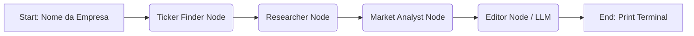

# 📘 Documentação do Fluxo: Agente de Equity Research

Este documento detalha a arquitetura e o funcionamento do fluxo automatizado desenvolvido com **LangChain** e **LangGraph** para o teste prático de análise de empresas de capital aberto.

---

## 1. Visão Geral da Solução

O projeto **Olimpia** é um agente autônomo que orquestra uma pipeline de pesquisa financeira. Ele recebe o nome de uma empresa e retorna um relatório executivo contendo perfil, notícias e cotação, atendendo integralmente aos requisitos do desafio.

### 🛠 Stack Tecnológica
*   **Orquestração:** LangGraph (StateGraph) & LangChain Core.
*   **LLM (Inteligência Artificial):** Google Gemini 2.0 Flash Lite.
*   **Ferramentas de Dados:** 
    *   `DuckDuckGo Search`: Web scraping de notícias e resumos.
    *   `yFinance`: Dados de mercado em tempo real.
*   **Linguagem:** Python 3.10+.

---

## 2. Arquitetura do Fluxo (Workflow)

O sistema utiliza uma arquitetura baseada em Grafos (**Graph-based Architecture**), onde o estado da pesquisa é passado sequencialmente entre nós especializados.

### 🔄 Diagrama Lógico


### 📦 Estado Compartilhado (`ResearchState`)
Um dicionário tipado (`TypedDict`) circula entre os nós acumulando as informações:
*   `company_name`: Input inicial (ex: "Petrobras").
*   `ticker`: Código identificado (ex: "PETR4.SA").
*   `summary_data`: Texto bruto sobre a empresa.
*   `news_data`: Lista de notícias e links.
*   `stock_data`: Preço atual da ação.
*   `final_report`: Relatório final formatado.

---

## 3. Detalhamento dos Nós (Requisitos)

### 🧩 1. Ticker Finder (Identificação)
*   **Objetivo:** Transformar o nome popular da empresa no código de negociação da B3.
*   **Lógica:**
    1. Tenta identificar padrões via Regex no input.
    2. Realiza buscas no Google/DuckDuckGo cruzando o nome da empresa com sites como `statusinvest.com.br` e `br.investing.com`.
    3. Aplica heurística de *fallback* (palpite) caso a busca falhe, garantindo que o fluxo não pare.

### 🧩 2. Researcher (Requisitos A e B)
Este nó é responsável pela coleta de dados não estruturados (Web Scraping).
*   **A. Resumo da Empresa:**
    *   Executa busca por "RI institucional" e "sobre a empresa".
    *   Extrai snippets de texto para compor o perfil corporativo.
*   **B. Notícias Recentes:**
    *   Realiza busca filtrada em fontes confiáveis: `Bloomberg`, `InfoMoney`, `Valor Econômico`, `Brazil Journal`.
    *   Coleta Título, URL e Resumo das 3 notícias mais relevantes.

### 🧩 3. Market Analyst (Requisito C)
*   **Objetivo:** Obter dados quantitativos precisos.
*   **Execução:**
    *   Utiliza a biblioteca `yfinance` para conectar à API do Yahoo Finance.
    *   Consulta o `fast_info.last_price` (preço em tempo real) ou o último fechamento (`history`) caso o mercado esteja fechado.
    *   Trata exceções caso o ticker não exista ou a API falhe.

### 🧩 4. Editor (Síntese com IA)
*   **Objetivo:** Transformar dados brutos em informação útil.
*   **Execução:**
    *   Envia todo o contexto acumulado para o modelo **Google Gemini**.
    *   Utiliza **Prompt Engineering** para instruir a IA a formatar a saída em Markdown, criando um relatório legível com seções claras.

---

## 4. Saída de Dados (Output)

O resultado é exibido diretamente no terminal (`stdout`), formatado com cores ANSI para melhor legibilidade.

**Exemplo de Output:**
```text
# Equity Research: Petrobras

## 🏢 Perfil Corporativo
A Petróleo Brasileiro S.A. é uma empresa de economia mista...

## 📰 Notícias Relevantes
* [Lucro da Petrobras sobe 20%](https://...) - Resultado impulsionado pelo pré-sal.
* [Novos investimentos em eólica](https://...) - Empresa diversifica portfólio.

## 💰 Mercado
* Ticker: PETR4.SA
* Preço: R$ 38.50
```

---

## 5. Como Executar

1.  **Instale as dependências:**
    ```bash
    pip install -r requirements.txt
    ```
2.  **Configure a API Key (Gratuita):**
    ```bash
    export GEMINI_API_KEY="sua_chave_aqui"
    ```
3.  **Rode o script:**
    ```bash
    python main.py "Nome da Empresa"
    ```
