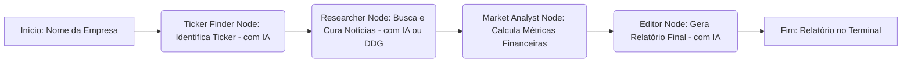

# 📊 Olimpia: Agente de AI para Equity Research

Agente autônomo de análise financeira desenvolvido para automatizar a coleta de dados preliminares de empresas de capital aberto (Investment Banking), entregando relatórios executivos ricos e precisos.

---

## 🚀 Visão Geral e Funcionalidades

O **Olimpia** orquestra um pipeline inteligente para gerar relatórios financeiros abrangentes. Ao receber o nome de uma empresa, ele realiza:

1.  **Identificação Inteligente do Ticker:** Converte o nome da empresa (ex: "Magazine Luiza") para seu código de negociação na B3 (ex: "MGLU3.SA"), utilizando dicionários internos, busca web e Inteligência Artificial (Gemini) para máxima precisão e resiliência a erros de digitação.
2.  **Coleta de Dados de Mercado:** Obtém cotações em tempo real, mínimas/máximas de 52 semanas, Dividend Yield (DY) e variação de 12 meses, calculados dinamicamente com base no histórico de preços (via `yfinance`).
3.  **Pesquisa e Curadoria de Notícias:** Realiza buscas avançadas na web (Google Search API ou DuckDuckGo) por notícias relevantes para investidores (resultados, fusões, dividendos, etc.). A IA (Gemini) atua como um "Editor Chefe", selecionando as 3 notícias mais impactantes de um pool de até 10, resumindo-as e mantendo os links originais.
4.  **Geração de Relatório Executivo:** Sintetiza todas as informações coletadas em um relatório formatado em Markdown, exibido de forma organizada e colorida diretamente no terminal.

---

## 🏗️ Stack Tecnológica

*   **Linguagem:** Python 3.10+
*   **Orquestração:** [LangChain](https://www.langchain.com/) & [LangGraph](https://langchain.github.io/langgraph/)
*   **LLM (Inteligência Artificial):** Google Gemini 2.5 Flash
*   **Ferramentas de Dados:**
    *   `yfinance`: Dados financeiros de mercado (preços, históricos, dividendos).
    *   `Google Custom Search API` (prioritário): Para buscas web de alta qualidade (requer configuração).
    *   `DuckDuckGo Search`: Fallback para buscas web ilimitadas (não requer configuração).
*   **Gestão de Ambiente:** `venv` (virtual environment)
*   **Configuração:** `python-dotenv` (para gerenciar chaves de API)

---

## 🧠 Arquitetura do Fluxo (LangGraph)

O sistema é construído sobre uma arquitetura de grafo, onde cada "nó" (agente) tem uma responsabilidade específica e o estado da pesquisa é passado de forma sequencial.



---

## ⚙️ Como Executar

### 1. Pré-requisitos

*   **Python 3.10+** instalado.
*   Conexão à internet.

### 2. Instalação das Dependências

Primeiro, crie e ative um ambiente virtual (recomendado) e instale as bibliotecas necessárias:

```bash
# Navegue até a pasta do projeto (onde está o main.py)
cd olimpia

# Cria o ambiente virtual (se ainda não existir)
python3 -m venv venv

# Ativa o ambiente virtual
# No Linux/macOS:
source venv/bin/activate
# No Windows (Command Prompt):
venv\Scripts\activate.bat
# No Windows (PowerShell):
venv\Scripts\Activate.ps1

# Instala as dependências
pip install -r requirements.txt
```

### 3. Obtenção das Chaves de API

O agente utiliza APIs externas para funcionar. Você precisará obter as chaves e IDs necessários.

#### a. Google Gemini API Key (Obrigatório para IA)

1.  Acesse o [Google AI Studio](https://aistudio.google.com/app/apikey).
2.  Crie uma nova chave de API.
3.  Guarde essa chave. Você pode criar múltiplas chaves (ex: `chave1,chave2,chave3`) para ativar a **rotação de chaves** do sistema, que ajuda a contornar limites de cota.

#### b. Google Custom Search Engine (CSE) ID e API Key (Opcional, mas Recomendado para Melhor Busca)

*   **Melhora drasticamente a qualidade da busca de notícias** em comparação com o DuckDuckGo, mas tem limite de 100 buscas/dia no plano gratuito.
*   **Recomendado se você quer resultados de notícias precisos para o seu vídeo.**

1.  **Crie uma Google API Key (se já não tiver uma):**
    *   Vá para o [Console de Desenvolvedores do Google](https://console.developers.google.com/apis/credentials).
    *   Crie um novo projeto ou selecione um existente.
    *   Em "Credenciais", clique em "Criar credenciais" > "Chave de API".
    *   Guarde essa chave.
2.  **Crie um Custom Search Engine (Motor de Busca Personalizado):**
    *   Acesse o [Painel do Google Custom Search](https://programmablesearchengine.google.com/controlpanel/all).
    *   Clique em "Adicionar novo mecanismo de pesquisa".
    *   No campo "Sites para pesquisar", adicione os domínios financeiros que o agente usa para notícias, por exemplo:
        *   `infomoney.com.br`
        *   `valor.globo.com`
        *   `br.investing.com`
        *   `moneytimes.com.br`
        *   `braziljournal.com`
        *   (e quaisquer outros que desejar)
    *   Dê um nome ao seu mecanismo (ex: "BuscaFinanceiraOlimpia").
    *   Após a criação, vá em "Visão geral" e copie o **ID do mecanismo de pesquisa**. Guarde esse ID.
3.  **Habilite a "Custom Search API":**
    *   No [Console de Desenvolvedores do Google](https://console.developers.google.com/apis/library/customsearch.googleapis.com), procure por "Custom Search API" e habilite-a para o seu projeto.

### 4. Configuração do Arquivo `.env`

O projeto usa o arquivo `.env` para gerenciar suas chaves de API de forma segura.

1.  Crie um arquivo chamado `.env` na raiz do projeto (`olimpia/.env`).
2.  Adicione suas chaves no formato abaixo. **Use a primeira das suas chaves Gemini como `GOOGLE_API_KEY` se for usar a busca do Google:**

    ```env
    # Chaves para o Google Gemini (LLM) - Use múltiplas separadas por vírgula para rotação
    GEMINI_API_KEY="SUA_CHAVE_GEMINI_1,SUA_CHAVE_GEMINI_2,SUA_CHAVE_GEMINI_3"

    # (Opcional) Chaves para o Google Custom Search API (melhor busca web)
    # COMENTE OU REMOVA AS LINHAS ABAIXO SE NÃO FOR USAR O GOOGLE SEARCH
    GOOGLE_CSE_ID="SEU_ID_DO_MOTOR_DE_BUSCA_AQUI"
    GOOGLE_API_KEY="SUA_CHAVE_DE_API_DO_GOOGLE_AQUI" # Pode ser a mesma da primeira chave GEMINI_API_KEY
    ```

### 5. Executar o Agente

Com o ambiente ativado e o `.env` configurado, você pode rodar o agente:

```bash
# Na pasta 'olimpia', com o ambiente virtual ATIVADO:
python main.py "Nome da Empresa"
```

**Exemplos:**

*   `python main.py "Petrobras"`
*   `python main.py "Magazine Luiza"`
*   `python main.py "Vale"`
*   `python main.py "Sanepar"`
*   `python main.py "Santander"`

Você também pode rodar sem especificar a empresa, e o agente irá pedir o nome:

```bash
python main.py
```

---

## 🧑‍💻 Estrutura do Código Modularizado

O projeto foi refatorado para uma estrutura modular, seguindo princípios de código limpo e escalabilidade.

```
olimpia/
├── src/
│   ├── config.py         # Definições de cores e carregamento inicial do .env
│   ├── state.py          # Definição do estado global do grafo (ResearchState)
│   ├── utils.py          # Funções utilitárias (supressão de logs, print colorido)
│   ├── nodes/            # Módulo para os agentes (nós do grafo)
│   │   ├── __init__.py
│   │   ├── ticker.py     # Lógica do TickerFinder (identificação com IA)
│   │   ├── researcher.py # Lógica do Researcher (busca e curadoria de notícias com IA)
│   │   ├── market.py     # Lógica do MarketAnalyst (cálculo de métricas financeiras)
│   │   └── editor.py     # Lógica do Editor (geração do relatório final com IA)
│   └── workflow.py       # Definição e compilação do grafo LangGraph
├── .env                  # Suas chaves de API (NÃO ENVIADO PARA GIT!)
├── .gitignore            # Ignora arquivos como .env e venv/
├── LICENSE               # Licença do projeto
├── README.md             # Documentação completa do projeto (este arquivo)
├── main.py               # Ponto de entrada da aplicação
└── requirements.txt      # Dependências do Python
```

---

*Projeto desenvolvido para o processo seletivo - Dezembro/2025*